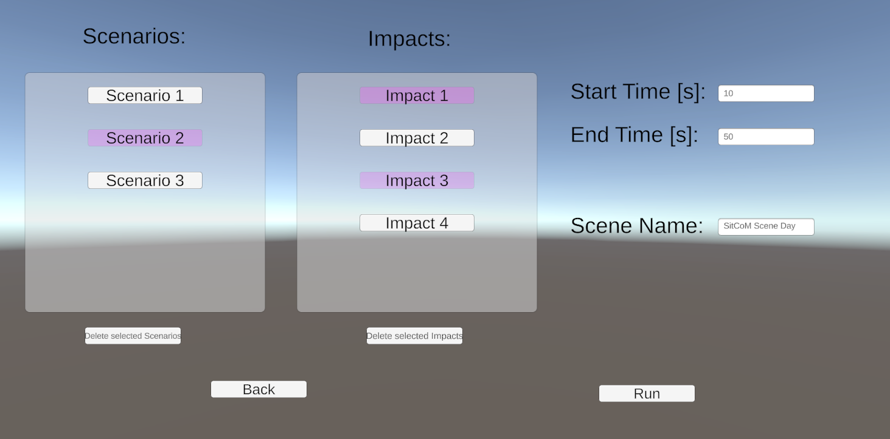
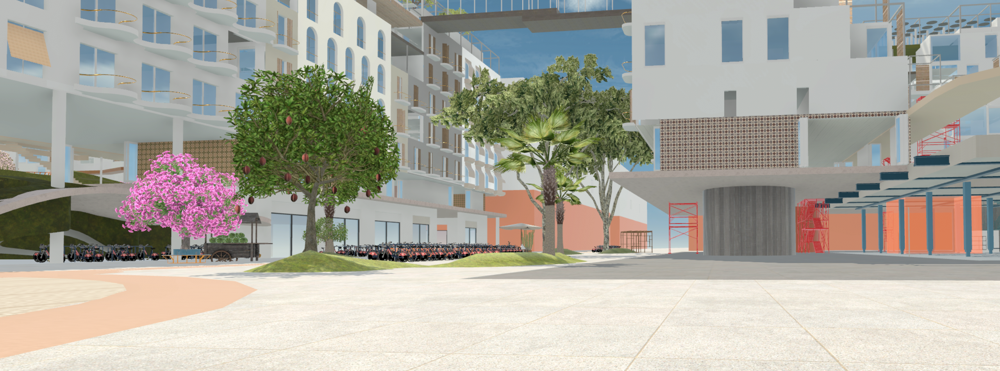
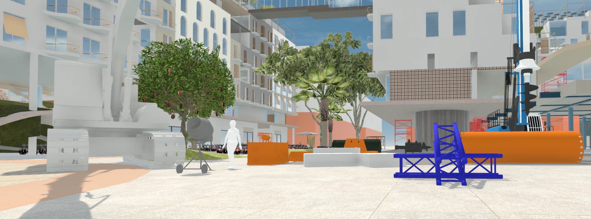
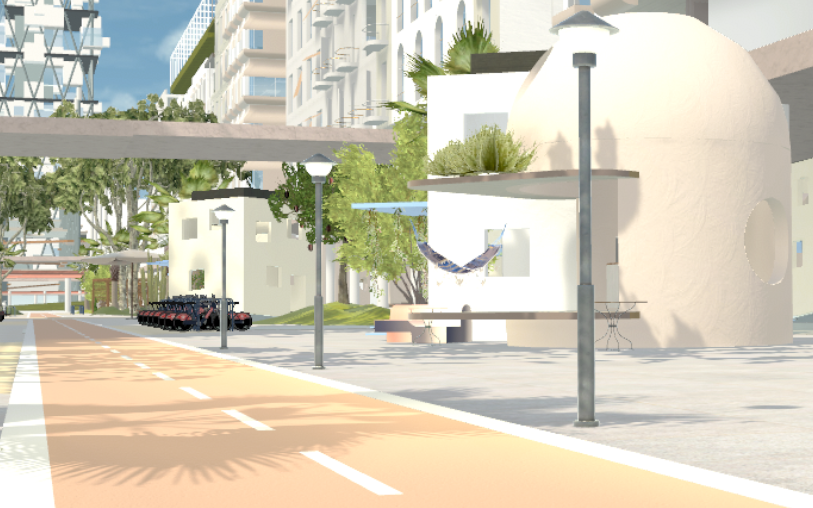
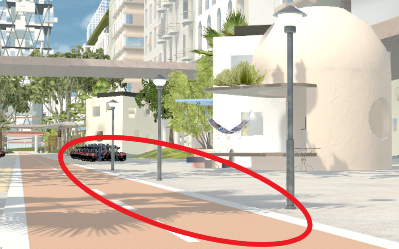

# Summary

Given the increasing prevalence of extreme events due to climate change, it becomes
imperative to be prepared for their impacts. Simulations of events in virtual environments
can be used for the evaluation of these effects. The Situation Control Menu (SitCoM)
provides a framework for this. This software package and the corresponding manual enables
users to integrate customized scenarios and their impacts into the game engine "Unity".
The scenario part can be done without any coding experience, while for the impacts a basic
knowledge of C# is required. Both multiple scenarios and impacts can be combined independently of each other, according to the user's needs.

# Statement of need

As extreme events are a growing
trend due to climate change [@Francis.1998; @Huber.2011], it is important, to understand their effects on anthropogenic environments.
These effects can only be on monetary level, but also e.g., physical damage to humans and other lifeforms. [Jentsch.2007]
Therefore, it is imperative to develop and evaluate appropriate countermeasures for the mitigation and withstanding of these events.

Currently, there is no wholistic approach for simulations of extreme events in virtual environments,
but only stand-alone simulations of single (extreme) events (e.g., @Morelli.2021).
SitCoM is a modular framework for the game engine Unity (Version: 2021.3.6f1),
which enables researchers to integrate and run customized scenarios and impacts.
Scenario refers to a visual representation of an event,
while impacts are the effects on objects in the environment.

The visual simulation of events is useful for public participation. This especially applies to
combined usage with Virtual Reality (VR). Partipicants then can experience an event immersively and express
their opinion well considered. Feasibility tests showed, that the integration of scenarios is easy
even for people without coding experience.

The impact side of SitCoM can especially be used for the testing of technological solutions
under different circumstances. By creating a digital twin of a solution and implementing its behavior
during an impact, the functionality can be evaluated afterwards. As impacts can differ greatly (e.g., electrical outages, physical damage, etc.), it is not possible to provide a manual for this. Hence, coding experience is required for this step.

The main advantage of SitCoM is, that the user can select the scenarios and/or impacts that should occur
in the virtual world before starting. Hence, a large variety of combinations can be created and used for
research. This is important for scenarios that can have various forms or impacts. E.g., extreme wind events
can be hurricanes, tornados, etc. Therefore, SitCoM does not couple scenarios and impacts.

{width=80%}

# Examples

SitCoM was tested in the virtual city of [Spectra](www.spectracities.com) [@Rzepecki.2023]. As the Unity version of the city is not available to the public, only
screenshots can be provided. Due to the stand-alone character of SitCoM, the functionalities can be ensured for
Unity projects in the correct version.

As seen in the following pictures, a construction site scenario has been implemented and started in SitCoM:
{width=80%}
{width=80%}

The impact for testing SitCoM is the electrical outage of streetlights:
{width=80%}
{width=80%}

# Acknoledgements

This work has been made possible through the support of NUMENA and Spectra Cities.

Funded by the European Union (ERC, scAInce, 101087218). Views and opinions expressed are however
those of the author(s) only and do not necessarily reflect those of the European Union or the
European Research Council Executive Agency. Neither the European Union nor the granting
authority can be held responsible for them.

{width=40%}

